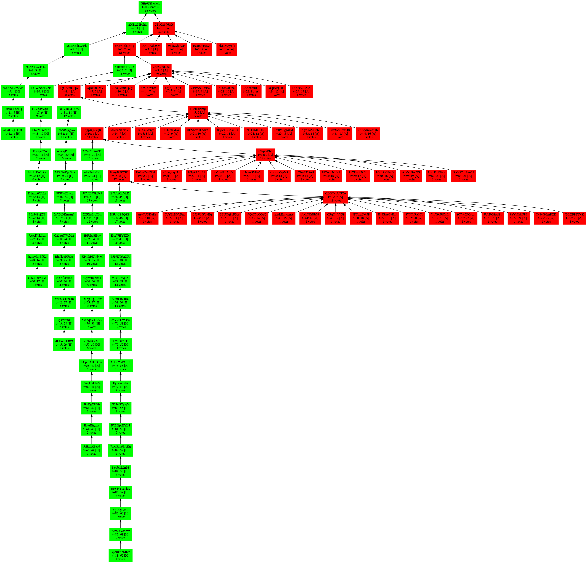
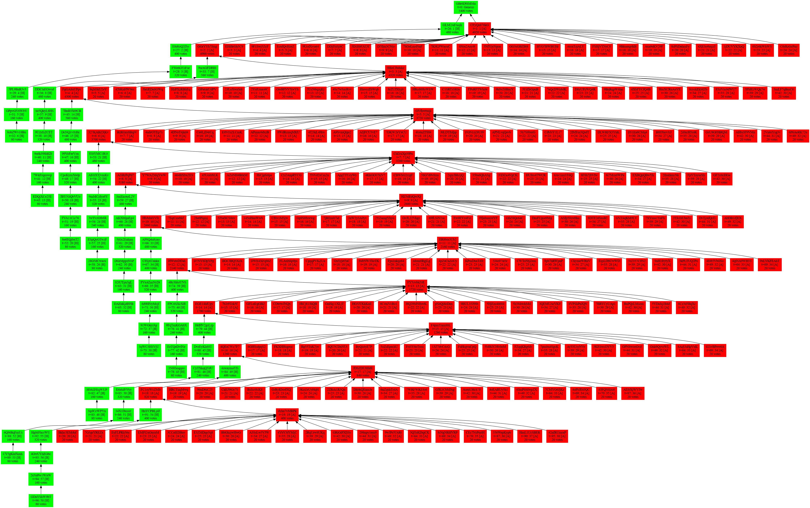

# Avalanche Attack on Proof-of-Stake GHOST

Authors: Joachim Neu, Ertem Nusret Tas, David Tse

## High Level

The Avalanche Attack on PoS (Proof-of-Stake) GHOST (Greedy Heaviest Observed Sub-Tree) combines *selfish mining* with *equivocations*. The adversary uses withheld blocks to displace an honest chain once it catches up in sub-tree weight with the number of withheld adversarial blocks. The withheld blocks are released in a flat but wide sub-tree, exploiting the fact that under the GHOST rule such a sub-tree can displace a long chain. Only two withheld blocks enter the canonical chain permanently, while the other withheld blocks can subsequently be reused (through equivocations) to build further sub-trees to displace even more honest blocks. The attack exploits a specific weakness of the GHOST rule in combination with equivocations from PoS. Formal security proof of PoS GHOST seems doomed.

For details, see the proof-of-concept implementation code.

## Proof-of-Concept

A proof-of-concept implementation is provided in [`ghost-avalanche-attack`](/ghost-avalanche-attack/). It provides settings to simulate the attack for vanilla PoS GHOST and the Committee-GHOST variant proposed for PoS Ethereum.

## Results

We plot a snapshot of the block tree (adversarial blocks: red, honest blocks: green) resulting after the last block tree reorganization within the first 100 time slots. The attack is still ongoing thereafter, and as long as the attack is sustained, no honest blocks enter the canonical chain.

### PoS GHOST

* Adversarial stake: 30%
* Initially withheld adversarial blocks: 5

### Committee-GHOST

* Adversarial stake: 20%
* Initially withheld adversarial blocks: 25

